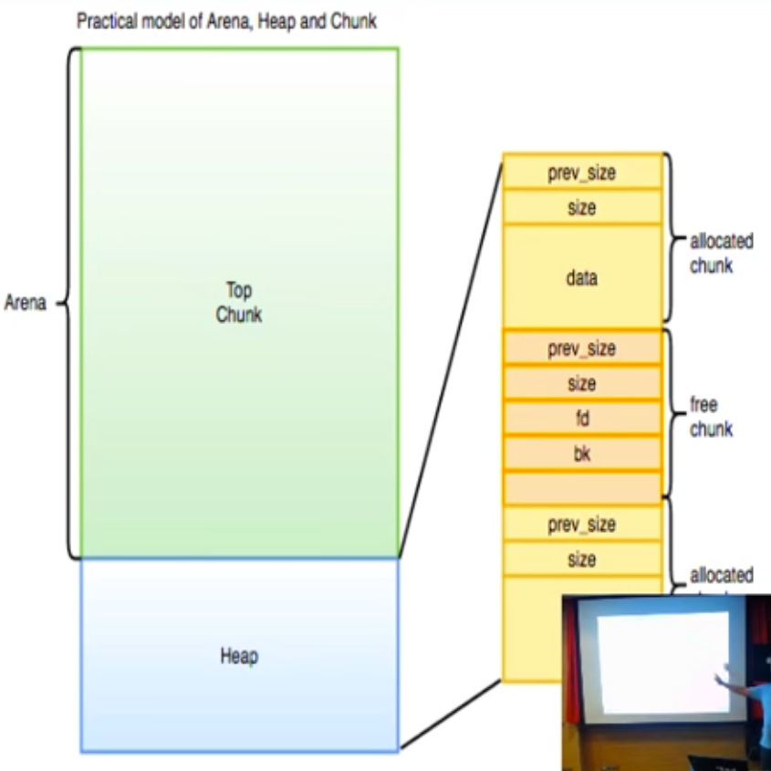

# Fonctionnement du Tas (Heap)

## Présentation du "tas"

Fonction : zone de la mémoire permettant d'allouer dynamique de l'espace pour les données des utilisateurs.

Deux fonctions principales pour utilser le tas :

- `malloc` : renvoie un pointeur vers la région réservée et de la taille demandée par le programme. 
- `free` : libère la zone d'espace dédiée par le pointeur.

Périmètre de ce document : l'algo *ptmalloc2* utilisé dans les librairies glibc sous Linux.

## Définitions

### Allocation du tas pour le thread principal

- `end_data` : pointeur qui désigne la fin du segment de données
- `start_brk`: pointeur qui désigne le début du segment du tas
- `brk` ou `program_break` : pointeur qui désigne la fin du segment du tas

Les fonctions `brk` et `sbrk` permette de gérer le segment du tas du thread principal. `sbrk` augmente la taille du tas. Le tas est située entre l'adresse pointée par  `start_brk` et celle pointée par `brk`.

### Allocation du tas pour l'ensemble des threads

Utilisation de `mmap(void *address, size_t length, int protecvt, int flags, int filedes, off_t offset)`.

Chaque thread peut avoir son propre tas, non partagée avec les autres threads ou avec le thread principal. Pour ce faire, `mmap` est utilisé.

## Description de l'organisation du tas

### Concepts de base

- *Arène* : bloc de mémoire disponible pour être alloué par le système et répondre aux futurs malloc pour un thread donné.

  

- *Tas* (*heap*) : bloc de mémoire continue composé de morceaux de mémoire appelés *bloc*s. Un tas n'est pas la même chose qu'un segment de tas (`start_brk` -> 'brk)' , qui contient à la fois le tas et l'arène
- *Bloc* (*chunk*): unité de base de gestion de la mémoire. Lorsqu'un `malloc` est appelé, il renvoie un pointeur sur un bloc. Chaque bloc existe dans un tas et appartient à une arène. 


### La structure de données de gestion des blocs

#### malloc_chunk

```
struct malloc_chunk {
  INTERNAL_SIZE_T      prev_size;  /* Size of previous chunk (if free).  */
  INTERNAL_SIZE_T      size;       /* Size in bytes, including overhead. */

  struct malloc_chunk* fd;                /* double links -- used only if free. */
  struct malloc_chunk* bk;
  
  /* Only used for large blocks: pointer to next larger size.  */
  struct malloc_chunk* fd_nextsize; /* double links -- used only if free. */
  struct malloc_chunk* bk_nextsize;
};
```

Les blocs peuvent être disponibles ou alloués. Leur structure change en fonction de cet état :

- `prev_size` est uniquement utilisé si le bloc est libre
- idem pour `fd` et `bk`

Lorsque d'un bloc est libéré, il est inséré dans la liste des blocs libres : `fd` et `bk` sont initialisés.

Les tailles de bloc sont des multiples de  8 : les 3 bits de poids faibles du champ `size` sont donc disponibles et peuvent être utilisés :

- `PREV_INUSE` : indique si le bloc précédent est utilisé
- `IS_MMAPED` : indique si le bloc est géré dans un `mmap`
- `NON_MAIN_ARENA` : indique si le bloc n'appartient pas à l'arène principale.


### malloc_state

Deux instances de `malloc_state` :

- `main_arena` : arène du thread principal, variableglobale dans le segment de données de `glibc`.
- `thread_arena` : arène des autres arènes n'appartenant pas au thread principal.

### Appels de la fonction `free`

Lorque la fonction `free` est appelée en passant un pointeur en paramètre, il est inséré dans une des deux tytpes de listes de blocs libres : `fastbinsY` ou `bins`. Ces blocs sont placés en réserve pour de futures utilisations.

#### Fastbins

Les `fastbins` des listes LIFO utilisées pour des petits blocs (en architecture 32 bits : 16 - 80 bytes, en architecture 64 bytes : 32 - 160 bytes) et des allocations très rapide. Chaque `fastbin` contient des blocs de la même taille. On a donc un ensemble de `fastbins` pour des  blocs de différentes tailles :

- en architecture 32 bits : 16, 24, 32 bytes...
- en architecture 64 bits : 32, 48, 64 bytes...


#### Bins

Les `bins` des listes FIFO doublement liées utilisées pour des blocs de plus grande taille. Les `bins` sont rassemblés par tailles :

- Bins pour des tailles < 512 bytes (resp 1024 en architecture 64 bits). Les chunks sont regroupés par taille selon le même principe que les `fastbins`. L'ensemble des `small bins` est enregistré par l'index des `bins`, de l'indice 2 à 64.
- Bins pour des tailles > 512 bytes (resp 1024 en architecture 64 bits). L'ensemble des `large bins` est enregistré par l'index des `bins`, de l'indice 65 à 127. La taille des `large bins` est répartie de manière logarithmique.

Il reste deux indices pour l'index `bins`:

- `bins[0]` n'existe pas
- `bins[1]` est le `unsorted bin` : garde la trace des `chunk` récemment libérés, sans les trier par taille. Les `blocs` juste libérés n'appartenant pas à la catégorie `fastchunk` sont d'abord placés dans cette liste. Si `malloc` se voit demander un bloc d'une taille donnée et qu'il ne la trouve pas dans les `fastbins` ou les `small bins`, il trie la liste des `unsorted bins`.


Dans les faits, une arène est implémentée sous la forme d'un `bloc` (`chunk`) , appelé `top chunk`. Ce `bloc` n'est jamais inclus dans un `bin`, et n'est utilisé par `malloc`que si aucun autre `bloc` correspondant à la taille souhaitée n'a été trouvé.



Dans ce cas, on va devoir couper en deux le `top chunk` pour fournir un `chunk` de la bonne taille en retour de `malloc`.


Si l'arène du thread n'est pas assez grande pour répondre à la demande du `malloc`, il faut l'agrandir. 

- Dans le thread principal, cela sera réalisé en appelant `sbrk`. 

  

- Dans le cas contraire, il sera fait appel à `mmap` pour créer une nouvelle arène. Le `top chunk` précédent est alors libéré, et on créé un nouveau tas avec la région récupérée par `mmap`. L'arène va alors contenir deux régions mappées mais probablement non adjacents. Ceci est généré à l'aide de la structure `heap_info`, dont on présente une synthèse :

```
struct heap_info {
		mstate ar_ptr;             /* Arena for this heap */
		struct _hear_info *prev;   /* Previous heap */
		size_t size;							 /* Current size in bytes */
}
```

Cette fonction n'existe pas dans le threads principal : les appels à `sbrk` font suffir.


## Fonctionnement de malloc


Dans le cas où il n'existe pas de bloc disponibles dans la `bin` correspondante, et qu'il y a des `blocs` disponibles dans la `fastbin`, `malloc` va essayer d'en rassembler pour obtenir un bloc de la bonne taille (`malloc consolidate`).

## Fonctionnement de free

La fonction principale de `free` est appelée  à travers la macro `unlink`. Son objectif : enlever un `bloc` d'une liste de blocs disponibles. Elle créé donc le lien *précédent* (*bk*) et le lien `suivant` entre le bloc précédent et le bloc suivant. Les dernières versions de `glibc` vérifient la cohérence de la liste.


Le détail de `free` de l'implémentation est le suivant


L'enjeu est alors de 'ranger' les blocs libérés au bon endroit, et de rassembler les blocs qui peuvent l'être (`consolidate backward` ou `consolidate forward`). 

`cmd.cprompt=dmhf;dmhb 1; dmh`


Astuce pour faire foncvtionner dmh et compagnie dans radare2 :

```
> e dbg.glibc.tcache=false
```


## Sources

https://www.youtube.com/watch?v=Svm5V4leEho&feature=emb_logo